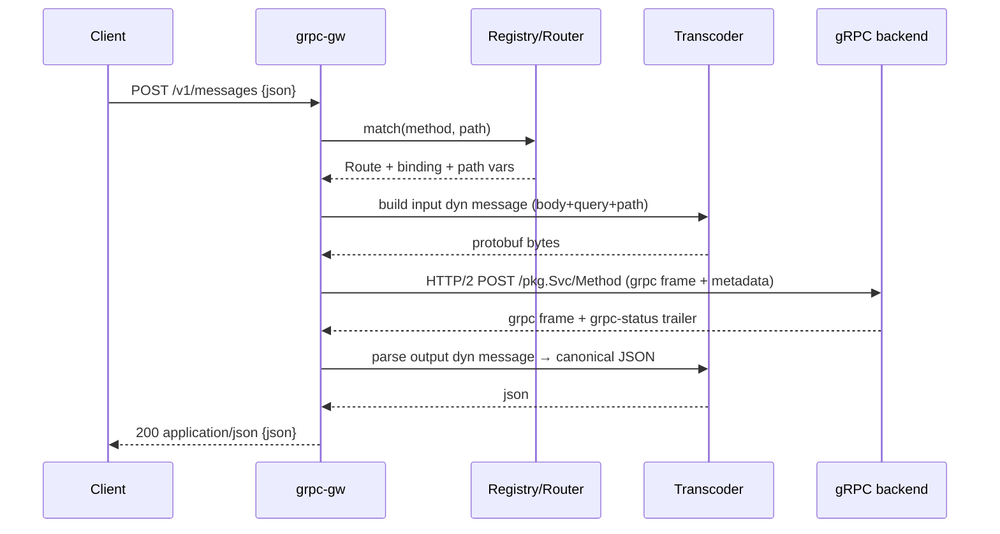

# grpc-gw — Rust gRPC-Gateway design

A Rust gRPC↔JSON transcoding reverse proxy in the spirit of Go's
[grpc-gateway](https://github.com/grpc-ecosystem/grpc-gateway), built on the
[`protobuf`](https://crates.io/crates/protobuf) crate (rust-protobuf) — **not
prost / tonic**.

This document is the architectural counterpart to the
[`tonic-rest` background note](../background/tonic-rest.md). Where `tonic-rest`
code-generates per-service Axum handlers that call Tonic traits in-process,
`grpc-gw` is an **out-of-process, fully dynamic proxy** that transcodes via
runtime reflection. The two solve overlapping problems with opposite
trade-offs; the "Why not tonic-rest / prost" section explains the split.

## Goals

- Stand up a REST/JSON front door for an existing gRPC backend with **no
  per-service Rust codegen** — drop in a `FileDescriptorSet` and go.
- Honor `google.api.http` annotations the way grpc-gateway does: path
  templates, `additional_bindings`, `body` selectors, query-param field-path
  expansion.
- Emit **proto3 canonical JSON** (int64-as-string, enums as
  `SCREAMING_SNAKE_CASE`, RFC 3339 timestamps, well-known-type encodings).
- Be wire-compatible enough with grpc-gateway that clients written against a
  Go gateway keep working.

### Non-goals (initial)

- Client-streaming and bidi-streaming transcoding (gateway pattern is
  awkward for these; defer).
- OpenAPI spec generation (separate tool, can reuse the descriptor set).
- gRPC-Web framing (different concern; can layer later).

## Why the `protobuf` crate (and not prost)

rust-protobuf ships exactly the runtime machinery a dynamic gateway needs,
which prost deliberately does not:

| Capability we need                | `protobuf` (rust-protobuf)                              | prost / tonic                                  |
| --------------------------------- | ------------------------------------------------------ | ---------------------------------------------- |
| Runtime reflection                | [`protobuf::reflect`](https://docs.rs/protobuf/latest/protobuf/reflect/index.html) — `FileDescriptor`, `MessageDescriptor`, `FieldDescriptor` | none (codegen-only structs)                    |
| Dynamic messages (no Rust type)   | `MessageDyn` + dynamic message built from a descriptor | none — every message is a concrete generated struct |
| Canonical proto3 JSON             | [`protobuf-json-mapping`](https://crates.io/crates/protobuf-json-mapping) (`parse_dyn_from_str`, `print_to_string`) | not provided; `prost` needs `prost-reflect` + hand-rolled JSON |
| Descriptor-set parsing            | [`protobuf::descriptor::FileDescriptorSet`](https://docs.rs/protobuf/latest/protobuf/descriptor/struct.FileDescriptorSet.html) — parse a pre-built `.pb`, no `protoc` at runtime | `prost-build` (codegen-focused)                |
| Read/write fields by name at runtime | `ReflectValueRef` / `ReflectValueBox` via `FieldDescriptor` | not possible without generated accessors       |

Because messages are **dynamic**, the gateway never compiles in knowledge of
any specific service. The same binary transcodes any backend whose descriptor
set it is handed. prost would force us to code-generate a concrete struct for
every message and then re-implement reflection and proto3 JSON on top — i.e.
reinvent what rust-protobuf already ships.

The proxy also never needs typed gRPC stubs: it forwards **opaque encoded
bytes** over HTTP/2, so tonic's prost-bound client is unnecessary.

## High-level architecture

```text
        HTTP/1.1 + HTTP/2  (REST / JSON)
                  │
                  ▼
        ┌───────────────────────┐
        │   Inbound HTTP server  │  hyper + tower
        └───────────┬───────────┘
                    │ matched route + path vars
                    ▼
        ┌───────────────────────┐     ┌────────────────────────┐
        │   Router / matcher     │◄────│  Descriptor registry   │
        │  (google.api.http)     │     │  FileDescriptorSet →    │
        └───────────┬───────────┘     │  reflect::FileDescriptor│
                    │                  └────────────────────────┘
                    ▼
        ┌───────────────────────┐
        │  Transcoder (request)  │  JSON/query/path → dynamic msg → bytes
        └───────────┬───────────┘
                    │ length-prefixed protobuf frame
                    ▼
        ┌───────────────────────┐
        │   gRPC client (h2)     │  application/grpc over HTTP/2 → backend
        └───────────┬───────────┘
                    │ response frame + grpc-status trailer
                    ▼
        ┌───────────────────────┐
        │  Transcoder (response) │  bytes → dynamic msg → canonical JSON
        └───────────┬───────────┘
                    ▼
            HTTP response / NDJSON stream
```

Everything between the two HTTP edges is descriptor-driven and message-type
agnostic.

## Crate layout

A **single crate** (`grpc-gw`) that is library-first so it can be embedded,
with the runnable gateway as a binary target inside the same crate. We start
with modules, not multiple crates — the seams below are a logical map, and a
module is only promoted to its own crate later if a concrete need appears
(e.g. gating an optional dependency).

```text
grpc-gw/
  Cargo.toml          # [lib] + [[bin]] name = "grpc-gw", path = "src/bin/grpc-gw.rs"
  src/
    lib.rs            # public API surface for embedders (re-exports)
    descriptor.rs     # registry, route table, path-template matcher, http-rule model
    transcode.rs      # JSON ⇄ dynamic message, query/path binding, coercion
    proxy.rs          # h2 gRPC client, gRPC framing, status mapping, streaming
    server.rs         # hyper/tower inbound server, middleware, config wiring
    bin/
      grpc-gw.rs      # thin main: parse config/args → build server → serve
```

| Module          | Role                                                                    | Key deps                                  |
| --------------- | ----------------------------------------------------------------------- | ----------------------------------------- |
| `descriptor`    | Descriptor registry, route table, path-template matcher, http-rule model | `protobuf`                                |
| `transcode`     | Request/response transcoding (JSON ⇄ dynamic message, query/path binding) | `protobuf`, `protobuf-json-mapping`, `serde_json` |
| `proxy`         | gRPC client over HTTP/2, gRPC framing, status mapping, streaming         | `h2`, `http`, `tokio`, `bytes`            |
| `server`        | Inbound HTTP server, middleware, config wiring                          | `hyper`, `tower`, `tower-http`, `tokio`   |
| `bin/grpc-gw`   | Thin `main` that wires the above into a runnable binary                 | the crate's own lib                       |

The gateway consumes only a **pre-built `FileDescriptorSet`** (a `.pb`), which
parses with `protobuf::descriptor` from the `protobuf` crate itself — so there
is **no `protobuf-parse` dependency and no `protoc` invocation at runtime**.
Optional/heavier dependencies are gated behind Cargo features rather than
separate crates — e.g. `tls` (pulls in `rustls`) — so embedders can opt out
without a crate split.

`google.api.http` lives in the descriptor's `MethodOptions` as extension
field **72295728**; we read it via the `protobuf::ext` / extension APIs rather
than depending on a generated `annotations.rs`.

## Descriptor loading

The gateway is configured with one **pre-built `FileDescriptorSet`** (a `.pb`)
plus the gRPC backend address. This is the *only* schema input: the gateway
never shells out to `protoc` and never parses `.proto` source at runtime.

**Pre-built `.pb` descriptor set** (`--descriptor-set path.pb` /
`descriptor_set = "…"`). Produced offline by
`protoc --include_imports --include_source_info -o set.pb …` (or `buf build
-o set.pb`). Parsed at startup with
`protobuf::descriptor::FileDescriptorSet::parse_from_bytes`, then loaded into a
`reflect::FileDescriptor` registry resolving imports in dependency order.
`--include_imports` is required so the set is self-contained (carries
`google/api/http.proto` and all transitive deps).

Why `.pb`-only:

- **No runtime `protoc`.** Parsing uses stable `protobuf::descriptor` types
  from the `protobuf` crate; nothing is compiled on the host at startup.
- **No `protobuf-parse` dependency** (whose README warns it has "no stable
  API").
- **Self-contained & reproducible.** One artifact carries the whole schema
  including imports; no include-path resolution or vendored `.proto` trees at
  runtime.

Producing the schema from `.proto` files is an **offline build step** the
operator runs (via `protoc`/`buf`), not something the gateway does. A future
alternative to the on-disk `.pb` is **gRPC server reflection** — calling the
backend's `grpc.reflection.v1.ServerReflection` service, which serves the
descriptors it already has compiled in as `FileDescriptorProto` messages, and
feeding them into the same registry (see Milestones). This is just "fetch the
descriptor set from the live backend instead of from a file" — the gateway
parses the same compiled descriptor form and still never runs `protoc`.

The result is a `DescriptorRegistry`:

```rust
pub struct DescriptorRegistry {
    files: Vec<protobuf::reflect::FileDescriptor>,
    // method full-name → resolved binding(s)
    routes: Vec<Route>,
}

pub struct Route {
    pub service: String,                 // package.Service
    pub method: String,                  // Method
    pub grpc_path: String,               // "/package.Service/Method"
    pub input: protobuf::reflect::MessageDescriptor,
    pub output: protobuf::reflect::MessageDescriptor,
    pub server_streaming: bool,
    pub bindings: Vec<HttpBinding>,      // primary + additional_bindings
}
```

## Route table & path templates

For every method we read the `google.api.http` `HttpRule` and lower it into a
matchable form. Unlike `tonic-rest` (single-segment vars, primary binding
only), we target grpc-gateway parity:

```rust
pub struct HttpBinding {
    pub method: HttpMethod,              // GET/POST/PUT/PATCH/DELETE/custom
    pub template: PathTemplate,          // compiled matcher
    pub body: BodySelector,              // Wildcard | None | Field(path)
    pub response_body: Option<FieldPath>,// response_body selector
}

pub enum BodySelector { Wildcard, None, Field(FieldPath) }
```

`PathTemplate` implements the grpc-gateway template grammar:

- Literal segments: `/v1/greeter/hello`.
- Single-segment capture: `{name}` → matches one path segment.
- Field-path capture: `{user.id}` → writes into nested message field.
- Multi-segment capture: `{name=shelves/*/books/*}` and `{path=**}` →
  matches multiple segments, including verbs (`:custom` suffix).

The matcher is built once at startup into a small trie keyed by HTTP method,
so request routing is O(path segments) with no per-request regex compilation.
`additional_bindings` produce additional `HttpBinding`s on the same `Route`,
all registered in the trie.

## Default binding policy (unannotated methods)

`google.api.http` annotations are **not required** for a method to be
reachable. They are required only to get *RESTful* URLs (custom verbs, path
parameters, query expansion, body selectors). A method with no `HttpRule`
still gets a working JSON endpoint via a synthesized default binding —
matching Go grpc-gateway's `generate_unbound_methods` behaviour.

For a method `M` on `package.Service`, the synthesized binding is:

```text
POST /package.Service/M
body: "*"            # full request message parsed from the JSON body
response: full message   # full response message as canonical proto3 JSON
```

Rules for the default binding:

- **Method:** always `POST`.
- **Path:** the gRPC wire path itself, `/{proto.package}.{Service}/{Method}`.
- **Body:** `Wildcard` (`body: "*"`) — everything must be in the JSON body.
- **Response:** the whole response message, no `response_body` narrowing.
- **No** path-parameter capture and **no** query-parameter expansion.

This is controlled by config flag `unbound_methods` (default `true`). When
enabled, every method without a primary `google.api.http` rule receives the
default binding above; methods *with* a rule are unaffected (their explicit
bindings, including `additional_bindings`, are used as-is). Set it to `false`
to expose only explicitly annotated methods.

> Contrast with `tonic-rest`, which **skips** any method lacking a
> `google.api.http` binding entirely — it never synthesizes a default route.
> grpc-gw (like grpc-gateway) instead defaults to the gRPC-path/`body:"*"`
> mapping so unannotated services are still usable over JSON.

## Request transcoding

Given a matched `Route` + `HttpBinding`, build the **input dynamic message**:

```rust
let mut msg = route.input.new_instance();   // dynamic message (Box<dyn MessageDyn>)
```

Population order (later steps override earlier, matching grpc-gateway):

1. **Body.** Depending on `BodySelector`:
   - `Wildcard` (`body: "*"`): parse the whole HTTP body as JSON into `msg`
     with `protobuf_json_mapping::merge_from_str` (uses the descriptor; honors
     proto3 JSON rules).
   - `Field(path)` (`body: "field"`): parse the body as JSON into the
     sub-message/field located by `path`, then assign via reflection. This is
     the selector `tonic-rest` rejects; we support it.
   - `None`: skip body (GET / DELETE without a body).
2. **Query parameters.** For any field *not* already bound by body or path,
   expand `?a.b.c=value&repeated=1&repeated=2` using proto field-path
   reflection, coercing each string to the target field type (proto3-JSON
   value rules for scalars, enums by name or number, repeated via repeated
   keys). Mirrors grpc-gateway's full field-path query expansion, not
   `tonic-rest`'s flat `serde_urlencoded`.
3. **Path variables.** Captures from `PathTemplate` are written last into
   their target field paths via reflection (single- or multi-segment).

All field writes go through `FieldDescriptor` + `ReflectValueBox`, so no
message type is known at compile time. Type/precision coercion (e.g. string→
`int64`, name→enum) is centralized in `grpc-gw-json::coerce`.

## gRPC client & framing

The proxy speaks raw gRPC over HTTP/2 — no typed stubs:

1. Serialize the input dynamic message: `msg.write_to_bytes_dyn()`.
2. Frame it: 1 compression byte (`0`) + 4-byte big-endian length + payload.
3. Open/borrow a pooled HTTP/2 connection to the backend (`h2::client`),
   send a `POST {grpc_path}` request with:
   - `content-type: application/grpc+proto`
   - `te: trailers`
   - forwarded metadata headers (see below).
4. Stream request frame(s) on the HTTP/2 stream.
5. Read response data frames, de-frame, and parse into the **output dynamic
   message**: `route.output.parse_from_bytes(payload)` (via descriptor).
6. Read the trailing `grpc-status` / `grpc-message` (and `grpc-status-details-bin`
   for `google.rpc.Status` details). Map to HTTP.

Connection pooling is per-backend-authority. The client never needs to know
message types — it shuttles bytes and lets the transcoder interpret them.

### Header / metadata forwarding

Like `tonic-rest`'s `build_tonic_request`, a configurable allow-list of
inbound HTTP headers is copied into gRPC metadata (default: `authorization`,
`user-agent`, `x-forwarded-for`, `x-real-ip`, `grpc-timeout`, plus
`x-request-id`). Pseudo-headers and hop-by-hop headers are stripped. The
reverse mapping copies a configurable set of response metadata back as HTTP
headers.

## Response transcoding

1. Take the output dynamic message.
2. If the binding has a `response_body` selector, narrow to that field.
3. Serialize with
   [`protobuf_json_mapping::print_to_string_with_options`](https://docs.rs/protobuf-json-mapping/latest/protobuf_json_mapping/fn.print_to_string_with_options.html),
   configured for canonical output (proto field names vs. `json_name`,
   emit-default-values toggle, enum-as-string).
4. `200 OK`, `content-type: application/json`.

### Status & error mapping

On non-`OK` `grpc-status`, render the grpc-gateway-compatible error envelope
(Status-proto JSON), not the `tonic-rest` Google-API-error shape:

```json
{ "code": 5, "message": "not found", "details": [ ... ] }
```

The gRPC code → HTTP status mapping follows grpc-gateway's table (all 16
codes, e.g. `NOT_FOUND`→404, `PERMISSION_DENIED`→403, `UNAVAILABLE`→503).
`grpc-status-details-bin` is decoded as `google.rpc.Status` and its `details`
(packed `Any`s) are rendered into `details` using the registry to resolve the
`Any` type URLs.

## Streaming

Server-streaming RPCs (`server_streaming: true`) are exposed as
**newline-delimited JSON** (`application/json` with one JSON object per line),
matching grpc-gateway's default. Each inbound gRPC data frame → one transcoded
JSON line, flushed immediately. A trailing error becomes a final
`{"error":{...}}` line. An optional SSE mode (`text/event-stream`, like
`tonic-rest`) is available behind a per-route/config switch for browser
consumers.

## Inbound server & middleware

`grpc-gw-server` runs hyper with a tower stack:

- TLS termination (optional, `rustls`).
- Tracing / access logs (`tower-http`).
- CORS (configurable; off by default).
- Auth hook: a pluggable `tower::Layer` that can short-circuit. A
  `public_paths` allow-list (cf. `tonic-rest`'s `PUBLIC_REST_PATHS`) bypasses
  it. Auth is intentionally *not* baked in — the gateway forwards credentials
  and lets the backend authorize, but a hook exists for edge auth.
- Timeouts / request body size limits.

The gateway is an out-of-process reverse proxy by default. Co-hosting it with
a tonic gRPC server in a single process (front-door steering + in-memory
backend transport) is described separately in
[co-hosting-with-tonic.md](./co-hosting-with-tonic.md) — lower priority,
not required for the milestones below.

```rust
let registry = DescriptorRegistry::load(&config)?;          // descriptors → routes
let backend  = GrpcClient::connect(&config.backend).await?; // pooled h2 client
let app      = grpc_gw::server::router(registry, backend, &config);
hyper::Server::bind(&addr).serve(app.into_make_service()).await?;
```

## Configuration sketch

```toml
listen = "0.0.0.0:8080"
backend = "http://127.0.0.1:50051"     # or https:// with TLS

[descriptors]
descriptor_set = "gen/api.pb"          # pre-built FileDescriptorSet (only input)
                                       # build offline: protoc --include_imports
                                       #   --include_source_info -o gen/api.pb …

[routing]
unbound_methods = true                 # synthesize POST /pkg.Svc/Method, body:"*"
                                       # for methods without google.api.http

[transcoding]
emit_default_values = false            # proto3 JSON: omit defaults
preserve_proto_field_names = false     # use json_name by default
streaming = "ndjson"                   # "ndjson" | "sse"

[headers]
forward = ["authorization", "x-request-id"]
public_paths = ["/v1/health"]
```

## Request lifecycle (end to end)



## Compatibility with grpc-gateway

Target parity (contrast with the `tonic-rest` row in
[the background note](../background/tonic-rest.md)):

| Aspect                       | grpc-gw (this design)                          | grpc-gateway (Go)            |
| ---------------------------- | ---------------------------------------------- | ---------------------------- |
| Annotation source            | `google.api.http`                              | `google.api.http`            |
| Unannotated methods          | Default `POST /pkg.Svc/Method` `body:"*"` (toggle) | Default binding via `generate_unbound_methods` |
| Path templates `{v=a/*/**}`  | Full template grammar                          | Full template grammar        |
| `additional_bindings`        | Supported                                      | Supported                    |
| `body: "field"`              | Supported                                      | Supported                    |
| Query param field paths      | Full `?a.b=c` reflection expansion             | Full expansion               |
| JSON codec                   | proto3 canonical (`protobuf-json-mapping`)     | proto3 canonical (`protojson`) |
| WKT / enums / int64          | Canonical (string int64, enum names, RFC 3339) | Canonical                    |
| Error envelope               | Status-proto JSON (`code`/`message`/`details`) | Status-proto JSON            |
| Server streaming             | NDJSON (default) / SSE (opt)                   | NDJSON                       |
| Runtime                      | Out-of-process reverse proxy                   | Out-of-process reverse proxy |
| Backend coupling             | Dynamic — any descriptor set, no codegen       | Codegen stubs per service    |

Notably grpc-gw is *more* dynamic than Go grpc-gateway, which still generates
`.pb.gw.go` stubs; here the descriptor set fully drives routing and
transcoding.

## Risks & open questions

- **Schema is `.pb`-only by design.** The gateway loads a pre-built
  `FileDescriptorSet` and never runs `protoc` or parses `.proto` at runtime,
  so it depends only on the stable `protobuf::descriptor` types (no
  `protobuf-parse`). The trade-off is that operators must produce the `.pb`
  offline (`protoc`/`buf`) and keep it in sync with the backend; a `check`
  subcommand validates a set before deploy.
- **Reading the `google.api.http` extension.** Confirm the extension-decoding
  ergonomics in `protobuf::ext` for custom options on `MethodOptions`; worst
  case, decode the raw `UnknownFields` of `MethodOptions` for field 72295728.
- **Dynamic message performance.** Reflection-based encode/decode is slower
  than monomorphized prost structs. Acceptable for a gateway (I/O-bound), but
  benchmark; cache per-route descriptor lookups and template matchers.
- **Streaming back-pressure** across the inbound HTTP and outbound HTTP/2
  streams needs care (tie `h2` flow control to the hyper body sink).
- **`Any` resolution** for error details and `google.protobuf.Any` fields
  requires every referenced type to be present in the registry.

## Milestones

1. **M1 — Unary happy path.** Descriptor-set loading, route table for primary
   `POST body:"*"` bindings plus the default unbound-method binding, h2 gRPC
   client, canonical JSON in/out, status mapping. Validate against a Go
   grpc-gateway using the same proto.
2. **M2 — Full http rule.** Path templates (multi-segment), query expansion,
   `body`/`response_body` selectors, `additional_bindings`.
3. **M3 — Streaming.** Server-streaming → NDJSON, then SSE option.
4. **M4 — Ergonomics.** A `check` subcommand that validates a `.pb` set offline
   (resolve every `google.api.http` rule, compile path templates, verify field
   paths, detect route conflicts) and fails non-zero for CI; hot descriptor
   reload; metrics/tracing. Optional extras: gRPC server-reflection loading
   (fetch the descriptor set from the live backend instead of a `.pb` file) and
   OpenAPI emit (stretch).

## Reference

- `tonic-rest` background: [docs/background/tonic-rest.md](../background/tonic-rest.md)
- [`protobuf`](https://crates.io/crates/protobuf) /
  [`reflect` module](https://docs.rs/protobuf/latest/protobuf/reflect/index.html)
- [`protobuf-json-mapping`](https://crates.io/crates/protobuf-json-mapping)
- [google.api.http transcoding spec](https://cloud.google.com/endpoints/docs/grpc/transcoding)
- [grpc-gateway](https://github.com/grpc-ecosystem/grpc-gateway)
