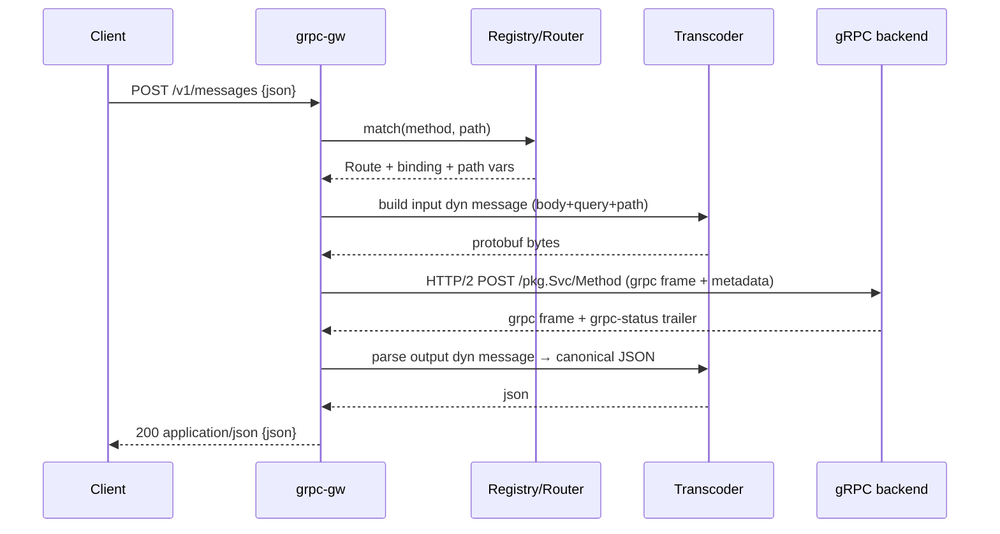

# grpc-gw — Rust gRPC-Gateway design

A Rust gRPC↔JSON transcoding reverse proxy in the spirit of Go's
[grpc-gateway](https://github.com/grpc-ecosystem/grpc-gateway), built on the
[`protobuf`](https://crates.io/crates/protobuf) crate (rust-protobuf) — **not
prost / tonic**.

This document is the architectural counterpart to the
[`tonic-rest` background note](../background/tonic-rest.md). Where `tonic-rest`
code-generates per-service Axum handlers that call Tonic traits in-process,
`grpc-gw` is an **out-of-process, fully dynamic proxy** that transcodes via
runtime reflection. The two solve overlapping problems with opposite
trade-offs; the "Why not tonic-rest / prost" section explains the split.

## Goals

- Stand up a REST/JSON front door for an existing gRPC backend with **no
  per-service Rust codegen** — drop in a `FileDescriptorSet` and go.
- Honor `google.api.http` annotations the way grpc-gateway does: path
  templates, `additional_bindings`, `body` selectors, query-param field-path
  expansion.
- Emit **proto3 canonical JSON** (int64-as-string, enums as
  `SCREAMING_SNAKE_CASE`, RFC 3339 timestamps, well-known-type encodings).
- Be wire-compatible enough with grpc-gateway that clients written against a
  Go gateway keep working.
- **Zero-config quickstart.** Point the gateway at a backend that exposes gRPC
  server reflection and it works with no descriptor file and no flags:
  `grpc-gw --backend http://127.0.0.1:50051 --reflection`. With a `.pb` it is
  `grpc-gw --backend … --descriptor-set api.pb`. Embedders get the same in
  ~5 lines (see [Tier 3](#tier-3--programmatic-construction)).
- **Be introspectable.** `grpc-gw routes` prints the resolved route table and
  `grpc-gw check` validates a descriptor set in CI, so what the gateway exposes
  is never a mystery (see [Introspection & validation](#introspection--validation)).

### Non-goals (initial)

- Client-streaming and bidi-streaming transcoding (gateway pattern is
  awkward for these; defer).
- gRPC-Web framing (different concern; can layer later).

## Why the `protobuf` crate (and not prost)

rust-protobuf ships exactly the runtime machinery a dynamic gateway needs,
which prost deliberately does not:

| Capability we need                | `protobuf` (rust-protobuf)                              | prost / tonic                                  |
| --------------------------------- | ------------------------------------------------------ | ---------------------------------------------- |
| Runtime reflection                | [`protobuf::reflect`](https://docs.rs/protobuf/latest/protobuf/reflect/index.html) — `FileDescriptor`, `MessageDescriptor`, `FieldDescriptor` | none (codegen-only structs)                    |
| Dynamic messages (no Rust type)   | `MessageDyn` + dynamic message built from a descriptor | none — every message is a concrete generated struct |
| Canonical proto3 JSON             | [`protobuf-json-mapping`](https://crates.io/crates/protobuf-json-mapping) (`parse_dyn_from_str`, `print_to_string`) | not provided; `prost` needs `prost-reflect` + hand-rolled JSON |
| Descriptor-set parsing            | [`protobuf::descriptor::FileDescriptorSet`](https://docs.rs/protobuf/latest/protobuf/descriptor/struct.FileDescriptorSet.html) — parse a pre-built `.pb`, no `protoc` at runtime | `prost-build` (codegen-focused)                |
| Read/write fields by name at runtime | `ReflectValueRef` / `ReflectValueBox` via `FieldDescriptor` | not possible without generated accessors       |

Because messages are **dynamic**, the gateway never compiles in knowledge of
any specific service. The same binary transcodes any backend whose descriptor
set it is handed. prost would force us to code-generate a concrete struct for
every message and then re-implement reflection and proto3 JSON on top — i.e.
reinvent what rust-protobuf already ships.

The proxy also never needs typed gRPC stubs: it forwards **opaque encoded
bytes** over HTTP/2, so tonic's prost-bound client is unnecessary.

## High-level architecture

```text
        HTTP/1.1 + HTTP/2  (REST / JSON)
                  │
                  ▼
        ┌───────────────────────┐
        │   Inbound HTTP server  │  hyper + tower
        └───────────┬───────────┘
                    │ matched route + path vars
                    ▼
        ┌───────────────────────┐     ┌────────────────────────┐
        │   Router / matcher     │◄────│  Descriptor registry   │
        │  (google.api.http)     │     │  FileDescriptorSet →    │
        └───────────┬───────────┘     │  reflect::FileDescriptor│
                    │                  └────────────────────────┘
                    ▼
        ┌───────────────────────┐
        │  Transcoder (request)  │  JSON/query/path → dynamic msg → bytes
        └───────────┬───────────┘
                    │ length-prefixed protobuf frame
                    ▼
        ┌───────────────────────┐
        │   gRPC client (h2)     │  application/grpc over HTTP/2 → backend
        └───────────┬───────────┘
                    │ response frame + grpc-status trailer
                    ▼
        ┌───────────────────────┐
        │  Transcoder (response) │  bytes → dynamic msg → canonical JSON
        └───────────┬───────────┘
                    ▼
            HTTP response / NDJSON stream
```

Everything between the two HTTP edges is descriptor-driven and message-type
agnostic.

## Crate layout

A **single crate** (`grpc-gw`) that is library-first so it can be embedded,
with two binary targets inside the same crate: the runnable gateway and a
standalone OpenAPI spec generator. We start with modules, not multiple crates
— the seams below are a logical map, and a module is only promoted to its own
crate later if a concrete need appears (e.g. gating an optional dependency).

```text
grpc-gw/
  Cargo.toml          # [lib] + [[bin]] grpc-gw + [[bin]] grpc-gw-openapi
  src/
    lib.rs            # public API surface for embedders (re-exports)
    descriptor.rs     # registry, route table, path-template matcher, http-rule model
    transcode.rs      # JSON ⇄ dynamic message, query/path binding, coercion
    proxy.rs          # h2 gRPC client, gRPC framing, status mapping, streaming
    server.rs         # hyper/tower inbound server, middleware, config wiring
    openapi.rs        # descriptor registry → OpenAPI/Swagger document (see openapi-generation.md)
    bin/
      grpc-gw.rs         # thin main: parse config/args → build server → serve
      grpc-gw-openapi.rs # thin main: load .pb → emit OpenAPI/Swagger spec
```

| Module          | Role                                                                    | Key deps                                  |
| --------------- | ----------------------------------------------------------------------- | ----------------------------------------- |
| `descriptor`    | Descriptor registry, route table, path-template matcher, http-rule model | `protobuf`                                |
| `transcode`     | Request/response transcoding (JSON ⇄ dynamic message, query/path binding) | `protobuf`, `protobuf-json-mapping`, `serde_json` |
| `proxy`         | `GrpcClient`: gRPC framing/status mapping over a `hyper_util` h2 `Client` (pluggable connector) | `hyper`, `hyper-util`, `http`, `tokio`, `bytes` |
| `server`        | Byte-stream `serve_connection` (HTTP decode) + tower middleware binding the `Gateway` service (no socket/TLS/config) | `hyper`, `hyper-util`, `tower`, `tower-http`, `tokio`   |
| `openapi`       | Descriptor registry → OpenAPI/Swagger document (see [openapi-generation.md](./openapi-generation.md)) | `protobuf`, `serde`, `serde_json` |
| `bin/grpc-gw`   | Thin `main` that wires the above into a runnable gateway binary          | the crate's own lib                       |
| `bin/grpc-gw-openapi` | Thin `main` that loads a `.pb` and emits an OpenAPI/Swagger spec   | the crate's own lib                       |

The gateway consumes only a **pre-built `FileDescriptorSet`** (a `.pb`), which
parses with `protobuf::descriptor` from the `protobuf` crate itself — so there
is **no `protobuf-parse` dependency and no `protoc` invocation at runtime**.
TLS is never owned by the core: it is applied by the caller as a byte-stream
adapter (see [Tier 1](#tier-1--raw-byte-streams-rest-in-grpc-out)). Optional/
heavier dependencies are gated behind Cargo features rather than separate
crates — e.g. a convenience `tls` feature wiring `tokio-rustls` helpers for the
`bin/grpc-gw` target — so embedders can opt out (and bring their own TLS)
without a crate split.

`google.api.http` lives in the descriptor's `MethodOptions` as extension
field **72295728**; we read it via the `protobuf::ext` / extension APIs rather
than depending on a generated `annotations.rs`.

## Library API boundary (streams, not config)

The config file is **not** the library's API boundary. It is a convenience the
*binary* parses at its edge and lowers into explicit, already-resolved values.
The middle layer (`grpc_gw` as a library) is built from those values and
exposes the protocol stack as **composable stream layers**, so embedders —
including the [co-hosting setup](./co-hosting-with-tonic.md) — never touch a
TOML file and can enter at whichever tier they need.

The boundary is layered, lowest to highest:

### Tier 1 — Raw byte streams (REST in, gRPC out)

The lowest seam is **untyped byte streams**. The inbound REST connection is an
arbitrary bidirectional byte stream carrying the HTTP/REST wire format; the
outbound backend connection is an arbitrary byte stream carrying the gRPC wire
format. "Byte stream" means anything implementing `tokio::io::AsyncRead +
AsyncWrite` — a TCP socket, a Unix socket, an in-memory `duplex`, a QUIC
stream, or a user-supplied custom type. The gateway runs HTTP framing + REST
decoding over the inbound stream and h2 + gRPC framing over the outbound one;
it never opens a socket itself.

```rust
// Inbound: hand the gateway one accepted connection's byte stream. The library
// decodes the REST/HTTP wire format off it; you own how the bytes arrive.
pub async fn serve_connection<IO>(io: IO, gateway: Gateway<impl Connect>)
    -> Result<(), ServeError>
where IO: AsyncRead + AsyncWrite + Unpin + Send + 'static;

// Outbound: the backend byte stream is produced by a hyper-util connector
// (`C: Connect`, a `tower::Service<Uri>` yielding the stream). TCP, TLS, Unix,
// in-memory duplex, and custom streams are all just connectors.
let client = hyper_util::client::legacy::Client::builder(TokioExecutor::new())
    .http2_only(true)
    .build(connector);              // connector owns how the byte stream is dialed
```

**TLS is a stream adapter, not a gateway feature.** Because both seams are just
byte streams, TLS plugs in by *wrapping the stream* before handing it over —
e.g. `tokio_rustls` turns a `TcpStream` into a `TlsStream` that is still
`AsyncRead + AsyncWrite`. The gateway terminates nothing and dials nothing:

```rust
// Inbound TLS termination: wrap the accepted socket, then serve over it.
let tls = acceptor.accept(tcp).await?;          // TlsStream: AsyncRead + AsyncWrite
serve_connection(tls, gateway.clone()).await?;

// Outbound TLS to the backend: use a TLS-capable connector (e.g. an
// `HttpsConnector`); the hyper-util Client handshakes h2 over it for you.
let client = hyper_util::client::legacy::Client::builder(TokioExecutor::new())
    .http2_only(true)
    .build(https_connector);
```

The same seam accepts **custom streams**: implement `AsyncRead + AsyncWrite`
(or compose existing adapters) and the gateway is none the wiser — inbound via
`serve_connection`, outbound via a connector that returns your stream. This is
exactly how the [co-hosting setup](./co-hosting-with-tonic.md) feeds an
in-memory `tokio::io::duplex` pipe in place of a socket on both sides.

### Tier 2 — Decoded messages & frames

If you already have a decoded HTTP request (you run your own hyper server, or
you are composing tower layers), skip the byte tier and use the message seam
directly. The gateway is a `tower::Service` over streaming HTTP: input is an
`http::Request` with a streaming body, output an `http::Response` with a
streaming body. No address, listener, TLS, or config struct crosses this seam.

```rust
impl tower::Service<http::Request<ReqBody>> for Gateway {
    type Response = http::Response<GatewayBody>;   // streaming body (unary or NDJSON/SSE)
    type Error    = std::convert::Infallible;      // all gRPC/HTTP errors are rendered into the response
    // ...
}
```

On the backend side there is **no bespoke transport trait** — the gateway
holds a `hyper_util::client::legacy::Client` in HTTP/2 mode and speaks gRPC
over it. hyper-util already provides the h2 handshake, per-authority connection
pooling, and stream multiplexing; a thin `grpc` helper adds the gRPC framing
(5-byte length prefix), the `te: trailers` / `content-type` headers, and reads
the trailing `grpc-status` off the response body's trailer frame. The only
gateway-owned piece is that small framing wrapper:

```rust
// Built-in client = hyper-util Client (http2_only) + gRPC framing. No new trait.
pub struct GrpcClient<C> {
    inner: hyper_util::client::legacy::Client<C, BoxBody<Bytes, Status>>,
    authority: http::uri::Authority,
}

impl<C: Connect + Clone + Send + Sync + 'static> GrpcClient<C> {
    /// Open a (server-streaming-capable) gRPC call: send length-prefixed
    /// request frames, stream back response frames, resolve the trailer status.
    pub async fn call(
        &self,
        path: &str,                          // "/pkg.Svc/Method"
        metadata: http::HeaderMap,           // forwarded request metadata
        body: BoxBody<Bytes, Status>,        // request frame stream
    ) -> Result<http::Response<hyper::body::Incoming>, Status>;
}
```

**Pluggability lives in the connector, not a trait.** hyper-util's `Client<C, B>`
is generic over a connector `C: Connect` — itself a `tower::Service<Uri>` that
yields a byte stream. That is the *same* Tier-1 seam: a TCP connector, a TLS
`HttpsConnector`, a Unix-socket connector, or an in-memory `duplex` connector
all slot in here, including for the [co-hosting](./co-hosting-with-tonic.md)
in-process backend. So "custom backend transport" = "supply a connector", and
we reuse hyper-util's pooling/h2 instead of reimplementing it behind a trait.

### Tier 3 — Programmatic construction

The `Gateway` is built from an already-parsed `DescriptorRegistry`, a
`GrpcClient` (hyper-util `Client` + gRPC framing), and a plain `GatewayOptions`
value (the routing/transcoding knobs) — never from a file path or a config
object. The client's connector is where TLS / custom streams compose:

```rust
let registry = DescriptorRegistry::from_descriptor_set(&pb_bytes)?;   // bytes in, not a path

// hyper-util Client in h2 mode; swap the connector for TLS/Unix/duplex/custom.
let client = hyper_util::client::legacy::Client::builder(TokioExecutor::new())
    .http2_only(true)
    .build(connector);                                                // any C: Connect
let backend = GrpcClient::new(client, backend_authority);

let gateway = Gateway::builder(registry)
    .backend(backend)
    .options(GatewayOptions { unbound_methods: true, ..Default::default() })
    .build();                                                          // a tower::Service

// Inbound: accept connections however you like and serve each byte stream.
loop {
    let (tcp, _) = listener.accept().await?;
    let io = maybe_wrap_tls(tcp).await?;        // your choice of TLS / custom adapter
    let gw = gateway.clone();
    tokio::spawn(async move { serve_connection(io, gw).await });
}
```

The TOML [configuration sketch](#configuration-sketch) below is therefore just
one producer of these inputs — descriptor bytes, a connector (optionally
TLS/custom) for the backend, `GatewayOptions`, and a listener — that the
`bin/grpc-gw` target assembles. Nothing under `src/` (lib, router, transcoder,
proxy) depends on a config file format, a particular socket type, or a TLS
library.

## Descriptor loading

> **Milestone:** M1 — both sources (file and reflection) land in the first cut.

The gateway needs one **descriptor set** plus the gRPC backend address. It
never shells out to `protoc` and never parses `.proto` source at runtime. The
descriptor set comes from one of two first-class sources:

### Source A — gRPC server reflection (zero-config)

Point the gateway at a backend that implements
`grpc.reflection.v1.ServerReflection` (`--reflection`) and it pulls the
descriptors the backend already has compiled in — **no descriptor file to
build, ship, or keep in sync.** This is the recommended onboarding path: the
gateway lists services, fetches their `FileDescriptorProto`s (resolving imports
transitively), and feeds them into the same registry the `.pb` path uses. It is
just "fetch the descriptor set from the live backend instead of from a file";
the gateway parses the same compiled descriptor form and still never runs
`protoc`. Reflection results are cached and refreshed on
[hot reload](#hot-reload).

> Trade-off: reflection couples startup to backend availability and requires
> the backend to expose the reflection service. Where that is undesirable
> (locked-down backends, air-gapped builds, deterministic deploys), use a
> pinned `.pb` (Source B).

### Source B — Pre-built `.pb` descriptor set

`--descriptor-set path.pb` / `descriptor_set = "…"`. Produced offline by
`protoc --include_imports --include_source_info -o set.pb …` (or `buf build
-o set.pb`). Parsed at startup with
`protobuf::descriptor::FileDescriptorSet::parse_from_bytes`, then loaded into a
`reflect::FileDescriptor` registry resolving imports in dependency order.
`--include_imports` is required so the set is self-contained (carries
`google/api/http.proto` and all transitive deps).

Why `.pb` (when you choose it over reflection):

- **No runtime `protoc`.** Parsing uses stable `protobuf::descriptor` types
  from the `protobuf` crate; nothing is compiled on the host at startup.
- **No `protobuf-parse` dependency** (whose README warns it has "no stable
  API").
- **Self-contained & reproducible.** One artifact carries the whole schema
  including imports; no include-path resolution or vendored `.proto` trees at
  runtime, and the deploy does not depend on backend availability.

Both sources converge on the same library entry point
`DescriptorRegistry::from_descriptor_set(bytes: &[u8])` — it takes the
descriptor bytes directly (the API boundary is bytes, not a path or config);
reading the `.pb` from disk, fetching it via reflection, or embedding it in
the binary is the caller's choice.

Producing the schema from `.proto` files is an **offline build step** the
operator runs (via `protoc`/`buf`), not something the gateway does.

The result is a `DescriptorRegistry`:

```rust
pub struct DescriptorRegistry {
    files: Vec<protobuf::reflect::FileDescriptor>,
    // method full-name → resolved binding(s)
    routes: Vec<Route>,
}

pub struct Route {
    pub service: String,                 // package.Service
    pub method: String,                  // Method
    pub grpc_path: String,               // "/package.Service/Method"
    pub input: protobuf::reflect::MessageDescriptor,
    pub output: protobuf::reflect::MessageDescriptor,
    pub server_streaming: bool,
    pub bindings: Vec<HttpBinding>,      // primary + additional_bindings
}
```

## Route table & path templates

> **Milestone:** primary/default bindings in **M1**; full path-template grammar
> (multi-segment, field-path captures, custom verbs) and `additional_bindings`
> in **M2**.

For every method we read the `google.api.http` `HttpRule` and lower it into a
matchable form. Unlike `tonic-rest` (single-segment vars, primary binding
only), we target grpc-gateway parity:

```rust
pub struct HttpBinding {
    pub method: HttpMethod,              // GET/POST/PUT/PATCH/DELETE/custom
    pub template: PathTemplate,          // compiled matcher
    pub body: BodySelector,              // Wildcard | None | Field(path)
    pub response_body: Option<FieldPath>,// response_body selector
}

pub enum BodySelector { Wildcard, None, Field(FieldPath) }
```

`PathTemplate` implements the grpc-gateway template grammar:

- Literal segments: `/v1/greeter/hello`.
- Single-segment capture: `{name}` → matches one path segment.
- Field-path capture: `{user.id}` → writes into nested message field.
- Multi-segment capture: `{name=shelves/*/books/*}` and `{path=**}` →
  matches multiple segments, including verbs (`:custom` suffix).

The matcher is built once at startup into a small trie keyed by HTTP method,
so request routing is O(path segments) with no per-request regex compilation.
`additional_bindings` produce additional `HttpBinding`s on the same `Route`,
all registered in the trie.

## Default binding policy (unannotated methods)

> **Milestone:** M1.

`google.api.http` annotations are **not required** for a method to be
reachable. They are required only to get *RESTful* URLs (custom verbs, path
parameters, query expansion, body selectors). A method with no `HttpRule`
still gets a working JSON endpoint via a synthesized default binding —
matching Go grpc-gateway's `generate_unbound_methods` behaviour.

For a method `M` on `package.Service`, the synthesized binding is:

```text
POST /package.Service/M
body: "*"            # full request message parsed from the JSON body
response: full message   # full response message as canonical proto3 JSON
```

Rules for the default binding:

- **Method:** always `POST`.
- **Path:** the gRPC wire path itself, `/{proto.package}.{Service}/{Method}`.
- **Body:** `Wildcard` (`body: "*"`) — everything must be in the JSON body.
- **Response:** the whole response message, no `response_body` narrowing.
- **No** path-parameter capture and **no** query-parameter expansion.

This is controlled by config flag `unbound_methods` (default `true`). When
enabled, every method without a primary `google.api.http` rule receives the
default binding above; methods *with* a rule are unaffected (their explicit
bindings, including `additional_bindings`, are used as-is). Set it to `false`
to expose only explicitly annotated methods.

> Contrast with `tonic-rest`, which **skips** any method lacking a
> `google.api.http` binding entirely — it never synthesizes a default route.
> grpc-gw (like grpc-gateway) instead defaults to the gRPC-path/`body:"*"`
> mapping so unannotated services are still usable over JSON.

## Request transcoding

> **Milestone:** `body:"*"` / full-message in **M1**; `body`/`response_body`
> field selectors, query-param expansion, and path-variable binding in **M2**.

Given a matched `Route` + `HttpBinding`, build the **input dynamic message**:

```rust
let mut msg = route.input.new_instance();   // dynamic message (Box<dyn MessageDyn>)
```

Population order (later steps override earlier, matching grpc-gateway):

1. **Body.** Depending on `BodySelector`:
   - `Wildcard` (`body: "*"`): parse the whole HTTP body as JSON into `msg`
     with `protobuf_json_mapping::merge_from_str` (uses the descriptor; honors
     proto3 JSON rules).
   - `Field(path)` (`body: "field"`): parse the body as JSON into the
     sub-message/field located by `path`, then assign via reflection. This is
     the selector `tonic-rest` rejects; we support it.
   - `None`: skip body (GET / DELETE without a body).
2. **Query parameters.** For any field *not* already bound by body or path,
   expand `?a.b.c=value&repeated=1&repeated=2` using proto field-path
   reflection, coercing each string to the target field type (proto3-JSON
   value rules for scalars, enums by name or number, repeated via repeated
   keys). Mirrors grpc-gateway's full field-path query expansion, not
   `tonic-rest`'s flat `serde_urlencoded`.
3. **Path variables.** Captures from `PathTemplate` are written last into
   their target field paths via reflection (single- or multi-segment).

All field writes go through `FieldDescriptor` + `ReflectValueBox`, so no
message type is known at compile time. Type/precision coercion (e.g. string→
`int64`, name→enum) is centralized in `grpc-gw-json::coerce`.

## gRPC client & framing

The proxy speaks raw gRPC over HTTP/2 — no typed stubs. It does **not**
hand-roll an h2 client: it uses a `hyper_util::client::legacy::Client` in
`http2_only` mode (which owns the handshake, per-authority pooling, and stream
multiplexing) and adds only the gRPC framing on top.

1. Serialize the input dynamic message: `msg.write_to_bytes_dyn()`.
2. Frame it: 1 compression byte (`0`) + 4-byte big-endian length + payload.
3. Send a `POST {grpc_path}` request through the hyper-util `Client` (which
   borrows/opens a pooled h2 connection via its connector) with:
   - `content-type: application/grpc+proto`
   - `te: trailers`
   - forwarded metadata headers (see below).
4. Stream request frame(s) as the request body.
5. Read response data frames off the response body, de-frame, and parse into
   the **output dynamic message**: `route.output.parse_from_bytes(payload)`
   (via descriptor).
6. Read the trailing `grpc-status` / `grpc-message` (and `grpc-status-details-bin`
   for `google.rpc.Status` details) from the response's trailer frame. Map to
   HTTP.

Connection pooling is hyper-util's, keyed per-backend-authority. The client
never needs to know message types — it shuttles bytes and lets the transcoder
interpret them.

### Header / metadata forwarding

Header↔metadata mapping is governed by **matcher hooks**, not just a static
list (matching grpc-gateway's `WithIncomingHeaderMatcher` /
`WithOutgoingHeaderMatcher` / `WithMetadata`). Defaults cover the common case;
embedders override for full control:

- **Incoming (HTTP → gRPC metadata).** A default allow-list (`authorization`,
  `user-agent`, `x-forwarded-for`, `x-real-ip`, `grpc-timeout`,
  `x-request-id`) plus a configurable **`Grpc-Metadata-` prefix**: any inbound
  header `Grpc-Metadata-Foo` becomes metadata `foo`. Pseudo-headers and
  hop-by-hop headers are always stripped.
- **Outgoing (gRPC metadata → HTTP).** A configurable set of response metadata
  keys is copied back as headers; trailing metadata is surfaced as
  `Grpc-Trailer-*` (grpc-gateway parity).
- **Deadline propagation.** An inbound `grpc-timeout` (or a configured request
  timeout) is propagated as the gRPC `grpc-timeout` header so the backend sees
  the client's deadline. When the inbound HTTP request is cancelled (client
  disconnect), the upstream gRPC stream is **reset/cancelled** so backend work
  is not leaked.

## Response transcoding

1. Take the output dynamic message.
2. If the binding has a `response_body` selector, narrow to that field.
3. Pick the marshaler for the negotiated `Accept` (default canonical proto3
   JSON via the [`Marshaler` hook](#pluggable-hooks)) and serialize \u2014 for JSON,
   [`protobuf_json_mapping::print_to_string_with_options`](https://docs.rs/protobuf-json-mapping/latest/protobuf_json_mapping/fn.print_to_string_with_options.html)
   configured by `GatewayOptions` (proto field names vs. `json_name`,
   `emit_default_values`, `enum_as_integer`).
4. `200 OK`, with the marshaler's `content-type` (`application/json` default).

### Status & error mapping

On non-`OK` `grpc-status`, render the grpc-gateway-compatible error envelope
(Status-proto JSON), not the `tonic-rest` Google-API-error shape:

```json
{ "code": 5, "message": "not found", "details": [ ... ] }
```

The gRPC code → HTTP status mapping follows grpc-gateway's table (all 16
codes, e.g. `NOT_FOUND`→404, `PERMISSION_DENIED`→403, `UNAVAILABLE`→503).
`grpc-status-details-bin` is decoded as `google.rpc.Status` and its `details`
(packed `Any`s) are rendered into `details` using the registry to resolve the
`Any` type URLs.

The status mapping and the envelope shape are both overridable via the
[`ErrorHandler` hook](#pluggable-hooks); the description above is the default.

## Pluggable hooks

> **Milestone:** M2.

To match grpc-gateway's extensibility (`runtime.ServeMux` options) the
`Gateway` accepts a small set of hooks via the builder. All have sane defaults;
none are required. They are plain trait objects / closures held in
`GatewayOptions`, so embedders and the binary configure them the same way.

| Hook                  | grpc-gateway analog                  | Purpose                                                                 |
| --------------------- | ------------------------------------ | ----------------------------------------------------------------------- |
| `Marshaler` (per MIME) | `WithMarshalerOption`                | Content negotiation on `Accept`/`Content-Type` — default canonical proto3 JSON; register others (compact JSON, protobuf passthrough) keyed by MIME |
| `ErrorHandler`        | `WithErrorHandler`                   | Render the error envelope + choose HTTP status from a gRPC `Status`; default is the [Status-proto JSON](#status--error-mapping) above |
| `StreamErrorHandler`  | `WithStreamErrorHandler`             | Render a trailing error inside an NDJSON/SSE stream                      |
| `IncomingHeaderMatcher` / `OutgoingHeaderMatcher` | `WithIncoming/OutgoingHeaderMatcher` | Decide which headers cross the HTTP↔metadata boundary (see [forwarding](#header--metadata-forwarding)) |
| `Metadata`            | `WithMetadata`                       | Inject extra gRPC metadata derived from the HTTP request (e.g. auth claims) |
| `auth: tower::Layer`  | (middleware)                         | Edge auth that can short-circuit; `public_paths` bypasses it            |

```rust
let gateway = Gateway::builder(registry)
    .backend(backend)
    .options(opts)
    .marshaler("application/json", CanonicalJson::default())   // default; override or add MIMEs
    .error_handler(my_error_handler)                          // optional
    .incoming_header_matcher(my_matcher)                      // optional
    .build();
```

Because marshaling is a hook keyed by MIME, the same gateway can serve
canonical JSON to browsers and, say, raw protobuf to internal callers from one
route — negotiated per request via `Accept`, exactly like Go's mux.

## Streaming

> **Milestone:** M3.

Server-streaming RPCs (`server_streaming: true`) are exposed as
**newline-delimited JSON** (`application/json` with one JSON object per line),
matching grpc-gateway's default. Each inbound gRPC data frame → one transcoded
JSON line, flushed immediately. A trailing error becomes a final
`{"error":{...}}` line. An optional SSE mode (`text/event-stream`, like
`tonic-rest`) is available behind a per-route/config switch for browser
consumers.

## Inbound server & middleware

`grpc-gw-server` runs hyper with a tower stack:

- TLS: **not** built into the service — the caller wraps each accepted byte
  stream in a TLS adapter (e.g. `tokio_rustls`) before serving it, per
  [Tier 1](#tier-1--raw-byte-streams-rest-in-grpc-out).
- Tracing / access logs (`tower-http`).
- CORS (configurable; off by default).
- Auth hook: a pluggable `tower::Layer` that can short-circuit. A
  `public_paths` allow-list (cf. `tonic-rest`'s `PUBLIC_REST_PATHS`) bypasses
  it. Auth is intentionally *not* baked in — the gateway forwards credentials
  and lets the backend authorize, but a hook exists for edge auth.
- Timeouts / request body size limits.

The gateway is an out-of-process reverse proxy by default. Co-hosting it with
a tonic gRPC server in a single process (front-door steering + in-memory
backend transport) is described separately in
[co-hosting-with-tonic.md](./co-hosting-with-tonic.md) — lower priority,
not required for the milestones below.

The `server` layer adapts the transport-agnostic `Gateway` service (see
[Library API boundary](#library-api-boundary-streams-not-config)) onto a
byte-stream connection; it consumes already-built components, never a config
file, and never owns the socket or TLS:

```rust
// `registry`, `backend`, and `opts` are produced by the caller — the binary
// parses TOML/flags into them; an embedder constructs them directly.
let gateway = grpc_gw::Gateway::builder(registry)
    .backend(backend)            // GrpcClient = hyper-util h2 Client + gRPC framing (any connector)
    .options(opts)               // GatewayOptions: routing/transcoding knobs
    .build();                    // tower::Service<http::Request<_>> → http::Response<_>

let app = grpc_gw::server::middleware(gateway, &middleware_opts); // cors/auth/timeouts/logging

// The accept loop owns the byte streams; TLS is just a wrapper you choose to apply.
loop {
    let (tcp, _) = listener.accept().await?;
    let io  = maybe_wrap_tls(tcp).await?;            // caller-supplied TLS / custom stream
    let svc = app.clone();
    tokio::spawn(async move { grpc_gw::server::serve_connection(io, svc).await });
}
```

## Introspection & validation

> **Milestone:** M1. See [m1-scope.md](./m1-scope.md) for the buildable M1 cut.

A "drop in a descriptor and go" tool must make its derived behaviour visible.
Two subcommands (and their library equivalents) do that, available from M1 — not
deferred:

- **`grpc-gw routes`** prints the resolved route table: for every binding, the
  HTTP method + path template, the target `pkg.Svc/Method`, the body selector,
  `response_body`, query-expanded fields, and whether it was synthesized
  (unbound default) or annotated. Output is human-readable or `--json` for
  tooling. This answers the question Go users constantly ask — "what routes did
  my annotations actually produce?"
- **`grpc-gw check`** validates a descriptor set offline and exits non-zero for
  CI: resolves every `google.api.http` rule, compiles path templates, verifies
  every field path referenced by a template/body/query against the message
  descriptors, and detects route conflicts (two bindings matching the same
  method+path). It is the same validation the server runs at startup, exposed
  as a gate so a bad `.pb` fails the pipeline, not production.

Both read a descriptor set from either source (file or `--reflection`) and run
purely on the registry, so they need no listening socket.

## Observability

> **Milestone:** M4.

For a proxy, observability is table stakes, not an afterthought. The `server`
layer wires three signals, all on by default in the binary and exposed as
middleware for embedders:

- **Structured access logs** (`tower-http` trace layer): one event per request
  with method, matched route, gRPC `pkg.Svc/Method`, status (HTTP + gRPC code),
  latency, and request id. Failures log the transcode/upstream cause.
- **Distributed tracing** (OpenTelemetry): a span per request; inbound
  `traceparent`/`tracestate` are parsed and **propagated into gRPC metadata**
  so the backend trace is one continuous trace. Spans annotate the route and
  gRPC status.
- **Metrics** (Prometheus, at `/metrics`): per-route request counts, latency
  histograms, in-flight gauge, and gRPC-status-code counters, plus upstream
  connection-pool stats from hyper-util.

These are pluggable: an embedder using the Tier-2 `tower::Service` simply omits
the middleware or substitutes their own layers.

### Transcoding error quality

When request JSON does not match the schema, the 400 carries a **structured,
field-pathed** message (e.g. `invalid value for field "user.age": expected
int32, got string`) rather than an opaque parser error — an explicit
improvement over grpc-gateway, whose transcode errors are often terse. The
same `ErrorHandler` hook can reshape these.

### Hot reload

> **Milestone:** M4.

The descriptor set can be reloaded without dropping connections (`SIGHUP` or an
admin endpoint). The swap is **atomic**: a new `DescriptorRegistry` + route
trie is built off-thread and swapped in behind an `ArcSwap`; in-flight requests
finish against the old table, new requests use the new one. A reload that fails
validation is rejected and the old table stays live.

## Configuration sketch

This TOML is a convenience of the **`bin/grpc-gw` target only**. The binary
parses it at its edge and lowers it into the programmatic inputs of the
[library API boundary](#library-api-boundary-streams-not-config) — descriptor
bytes, a backend `GrpcClient` (over a connector), `GatewayOptions`, the
[hooks](#pluggable-hooks), and middleware options. The library itself has no
notion of this file; embedders build those values directly.

```toml
listen = "0.0.0.0:8080"
backend = "http://127.0.0.1:50051"     # or https:// with TLS

[descriptors]
descriptor_set = "gen/api.pb"          # pre-built FileDescriptorSet
reflection = false                     # or fetch descriptors from the backend
                                       # (mutually exclusive with descriptor_set)
                                       # build .pb offline: protoc --include_imports
                                       #   --include_source_info -o gen/api.pb …

[routing]
unbound_methods = true                 # synthesize POST /pkg.Svc/Method, body:"*"
                                       # for methods without google.api.http

[transcoding]
emit_default_values = false            # proto3 JSON: omit defaults
preserve_proto_field_names = false     # use json_name by default
enum_as_integer = false                # enums as names (false) or numbers (true)
streaming = "ndjson"                   # "ndjson" | "sse"

[headers]
forward = ["authorization", "x-request-id"]
incoming_prefix = "Grpc-Metadata-"     # header→metadata passthrough prefix
outgoing_prefix = "Grpc-Metadata-"     # metadata→header back-mapping prefix
public_paths = ["/v1/health"]

[observability]
access_log = true                      # structured per-request logs
tracing = true                         # OpenTelemetry spans + traceparent propagation
metrics = "/metrics"                   # Prometheus endpoint (empty = off)
```

## Request lifecycle (end to end)



## Compatibility with grpc-gateway

Target parity (contrast with the `tonic-rest` row in
[the background note](../background/tonic-rest.md)):

| Aspect                       | grpc-gw (this design)                          | grpc-gateway (Go)            |
| ---------------------------- | ---------------------------------------------- | ---------------------------- |
| Annotation source            | `google.api.http`                              | `google.api.http`            |
| Unannotated methods          | Default `POST /pkg.Svc/Method` `body:"*"` (toggle) | Default binding via `generate_unbound_methods` |
| Path templates `{v=a/*/**}`  | Full template grammar                          | Full template grammar        |
| `additional_bindings`        | Supported                                      | Supported                    |
| `body: "field"`              | Supported                                      | Supported                    |
| Query param field paths      | Full `?a.b=c` reflection expansion             | Full expansion               |
| JSON codec                   | proto3 canonical (`protobuf-json-mapping`)     | proto3 canonical (`protojson`) |
| WKT / enums / int64          | Canonical (string int64, enum names, RFC 3339) | Canonical                    |
| Error envelope               | Status-proto JSON (`code`/`message`/`details`) | Status-proto JSON            |
| Custom marshaler (per MIME)  | `Marshaler` hook, `Accept`-negotiated           | `WithMarshalerOption`        |
| Error / header / metadata hooks | `ErrorHandler`, `Incoming/OutgoingHeaderMatcher`, `Metadata` | `WithErrorHandler`, `With*HeaderMatcher`, `WithMetadata` |
| `Grpc-Metadata-*` / `Grpc-Trailer-*` | Supported                               | Supported                    |
| Descriptor source            | `.pb` file **or** gRPC server reflection        | Codegen (`.pb.gw.go`)        |
| Server streaming             | NDJSON (default) / SSE (opt)                   | NDJSON                       |
| Runtime                      | Out-of-process reverse proxy                   | Out-of-process reverse proxy |
| Backend coupling             | Dynamic — any descriptor set, no codegen       | Codegen stubs per service    |

Notably grpc-gw is *more* dynamic than Go grpc-gateway, which still generates
`.pb.gw.go` stubs; here the descriptor set fully drives routing and
transcoding.

## Risks & open questions

- **Schema sources.** The gateway loads descriptors from a pre-built `.pb`
  **or** gRPC server reflection and never runs `protoc` / parses `.proto` at
  runtime, so it depends only on the stable `protobuf::descriptor` types (no
  `protobuf-parse`). The `.pb` path needs the operator to produce and sync the
  artifact (the `check` command gates it); the reflection path couples startup
  to backend availability and requires the reflection service exposed.
- **Reading the `google.api.http` extension.** Confirm the extension-decoding
  ergonomics in `protobuf::ext` for custom options on `MethodOptions`; worst
  case, decode the raw `UnknownFields` of `MethodOptions` for field 72295728.
  This is on the critical path for M1/M2 (the whole route table depends on it),
  so de-risk it first.
- **Dynamic message performance.** Reflection-based encode/decode is slower
  than monomorphized prost structs. Acceptable for a gateway (I/O-bound), but
  benchmark; cache per-route descriptor lookups and template matchers.
- **Streaming back-pressure & cancellation** is the hardest part of matching
  Go's robustness: tie the inbound `hyper` body sink to the outbound client
  flow control with bounded channels so a slow REST client cannot run the proxy
  out of memory, and reset the upstream gRPC stream when the inbound request is
  cancelled (client disconnect) so backend work is not leaked.
- **`Any` resolution** for error details and `google.protobuf.Any` fields
  requires every referenced type to be present in the registry.

## Milestones

1. **M1 — Unary happy path.** Descriptor-set loading (file **and** reflection),
   route table for primary `POST body:"*"` bindings plus the default
   unbound-method binding, h2 gRPC client, canonical JSON in/out, status
   mapping, and the `routes` / `check` introspection commands. Validate against
   a Go grpc-gateway using the same proto. **Full buildable scope, non-goals,
   and acceptance criteria: [m1-scope.md](./m1-scope.md).**
2. **M2 — Full http rule.** Path templates (multi-segment), query expansion,
   `body`/`response_body` selectors, `additional_bindings`, and the
   [pluggable hooks](#pluggable-hooks) (marshaler, error handler, header
   matchers, metadata).
3. **M3 — Streaming.** Server-streaming → NDJSON, then SSE option, with inbound/
   outbound back-pressure and client-cancel propagation.
4. **M4 — Ergonomics.** Observability (access logs, OpenTelemetry, Prometheus),
   hot descriptor reload, and OpenAPI/Swagger emit — see
   [openapi-generation.md](./openapi-generation.md) (stretch).

## Reference

- `tonic-rest` background: [docs/background/tonic-rest.md](../background/tonic-rest.md)
- M1 buildable scope: [m1-scope.md](./m1-scope.md)
- OpenAPI/Swagger generation: [openapi-generation.md](./openapi-generation.md)
- [`protobuf`](https://crates.io/crates/protobuf) /
  [`reflect` module](https://docs.rs/protobuf/latest/protobuf/reflect/index.html)
- [`protobuf-json-mapping`](https://crates.io/crates/protobuf-json-mapping)
- [google.api.http transcoding spec](https://cloud.google.com/endpoints/docs/grpc/transcoding)
- [grpc-gateway](https://github.com/grpc-ecosystem/grpc-gateway)
