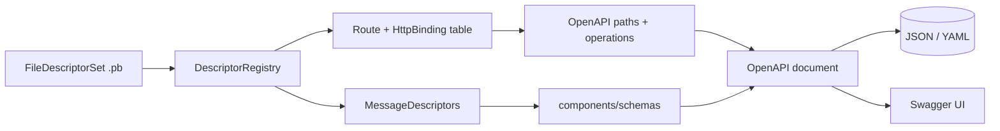

# Generating an OpenAPI / Swagger spec from the descriptor set

> **Status: M4 ergonomics (stretch).** The primary
> [grpc-gw design](./grpc-gateway-design.md) lists "OpenAPI emit" as an
> optional extra in milestone M4. This note specifies how the gateway produces
> a Swagger / OpenAPI document from the *same* pre-built `FileDescriptorSet`
> that drives routing and transcoding, so the published REST contract stays in
> lockstep with what the gateway actually serves.

## Goals

- Emit a machine-readable REST contract (**OpenAPI 3.0** by default,
  **Swagger 2.0** for grpc-gateway parity) directly from the descriptor set —
  **no `protoc`, no codegen, no second source of truth**.
- Reuse the gateway's own route lowering (`HttpBinding`, `PathTemplate`, body /
  query / path binding) so the spec describes the routes the gateway *actually*
  exposes — including synthesized default bindings for unannotated methods.
- Render request/response bodies as **proto3 canonical JSON** schemas, matching
  the bytes the transcoder produces (int64-as-string, enums as
  `SCREAMING_SNAKE_CASE`, WKT encodings, RFC 3339 timestamps).
- Honor grpc-gateway's `protoc-gen-openapiv2` option annotations
  (`grpc.gateway.protoc_gen_openapiv2.options`) when present, so existing
  protos that already carry doc/metadata annotations produce comparable output.

### Non-goals (initial)

- A live, request-driven spec server beyond serving the static document and an
  embedded Swagger UI (no per-request schema negotiation).
- Round-tripping an OpenAPI document *back* into proto (this is one-way:
  descriptors → spec).
- Faithful modeling of streaming semantics OpenAPI cannot express (see
  [Streaming](#streaming)).

## Where it lives

OpenAPI emission is an **offline, descriptor-driven** operation — the same
class of work as the `check` subcommand, but it ships as its **own binary**
separate from the gateway, so producing a spec needs neither the running proxy
nor a backend address. It is exposed two ways:

1. **Standalone binary** (primary), `grpc-gw-openapi`:

   ```text
   grpc-gw-openapi --descriptor-set gen/api.pb \
                   --openapi-version 3 \
                   --out gen/api.openapi.json
   ```

   It links the crate's library and reuses the gateway's own route lowering;
   it deliberately does **not** start a server, open a backend connection, or
   read the runtime config's `listen`/`backend` fields. The only required
   input is the `FileDescriptorSet` — exactly what the gateway itself loads.

2. **Served endpoint** (optional, behind config): the running gateway serves
   the generated document at a configurable path (default `/openapi.json`) and,
   if enabled, a bundled **Swagger UI** at `/docs`. Because the document is a
   pure function of the loaded `DescriptorRegistry`, it is generated once at
   startup and cached.

Both paths share one library module, `openapi`, that consumes an already-built
`DescriptorRegistry` — it does not re-parse `.proto` or re-read the `.pb`
beyond loading the descriptor set. The standalone binary builds the registry
directly from the `.pb`; the served endpoint reuses the gateway's registry.

```text
grpc-gw/
  Cargo.toml          # adds a second [[bin]] target for the generator
  src/
    openapi.rs        # registry → OpenAPI/Swagger document (serde_json::Value or typed model)
    bin/
      grpc-gw.rs          # the gateway server (primary binary)
      grpc-gw-openapi.rs   # thin main: parse args → load .pb → emit spec
```

| Module / target     | Role                                                            | Key deps                    |
| ------------------- | -------------------------------------------------------------- | --------------------------- |
| `openapi`           | Lower `DescriptorRegistry` routes + message descriptors into an OpenAPI/Swagger document | `protobuf`, `serde`, `serde_json` |
| `bin/grpc-gw-openapi` | Thin `main`: parse args, load the `.pb` into a registry, call `openapi`, write the document | the crate's own lib         |

The generator depends only on the descriptor reflection types already in use;
no new heavyweight dependency is required (an optional typed model crate such
as `okapi`/`openapiv3` can back the document, but a `serde_json::Value` builder
keeps the surface minimal).

## Pipeline



The route table is the **same structure** the router builds (see
[Route table & path templates](./grpc-gateway-design.md#route-table--path-templates)).
Emitting the spec is therefore a second consumer of that table, guaranteeing
the documented paths and the served paths cannot drift.

## Operations: routes → paths

For every `Route` and each of its `HttpBinding`s, emit one OpenAPI operation:

- **Path.** Translate the compiled `PathTemplate` into an OpenAPI path with
  `{var}` placeholders:
  - Single-segment capture `{name}` → `{name}` path item + a `path` parameter.
  - Field-path capture `{user.id}` → parameter named `user.id` (dotted), bound
    to the nested field.
  - Multi-segment capture `{name=shelves/*/books/*}` / `{path=**}` → a single
    path parameter; annotate with `x-grpc-gateway-pattern` and (for OpenAPI 3)
    leave the value untyped string, since OpenAPI path templating cannot
    express multi-segment matches. Custom verbs (`:custom`) are appended as
    literal suffixes.
- **Method.** From `HttpBinding.method` (`GET`/`POST`/`PUT`/`PATCH`/`DELETE`;
  custom verbs map to `POST` with the verb encoded in the path suffix).
- **`operationId`.** `{Service}_{Method}` (plus a binding-index suffix when a
  method has `additional_bindings`, e.g. `Library_GetBook_1`), matching
  grpc-gateway's disambiguation.
- **`tags`.** The proto service short name, so Swagger UI groups operations by
  service.
- **Default (unbound) bindings** are emitted too when `unbound_methods` is on:
  `POST /pkg.Svc/Method` with a `requestBody` of the full input message. This
  keeps the spec aligned with the gateway's
  [default binding policy](./grpc-gateway-design.md#default-binding-policy-unannotated-methods).

### Parameters

- **Path parameters** come from the template captures (`in: path`,
  `required: true`), typed from the target field's scalar schema.
- **Query parameters** are synthesized for every input field *not* consumed by
  the body or a path capture, using the same field-path expansion the
  transcoder uses (`?a.b.c=…`). Each becomes an `in: query` parameter named by
  its dotted field path:
  - Repeated fields → `style: form, explode: true` (OpenAPI 3) /
    `collectionFormat: multi` (Swagger 2).
  - Enums → string schema with the enum value names.
  - Message-typed nested fields are flattened into dotted leaf scalars (the
    gateway does not accept JSON-in-query), matching grpc-gateway.
  - When the body selector is `Wildcard` (`body: "*"`), **no** query parameters
    are emitted (every field is in the body).

### Request body

Driven by `HttpBinding.body` (`BodySelector`):

| `BodySelector`   | `requestBody`                                                            |
| ---------------- | ----------------------------------------------------------------------- |
| `Wildcard` (`*`) | `$ref` to the full input message schema                                 |
| `Field(path)`    | `$ref` to the schema of the sub-message/field at `path`                 |
| `None`           | no `requestBody` (GET/DELETE)                                           |

Content type `application/json`.

### Responses

- **`200`** — body schema is the output message, narrowed to the
  `response_body` field when the binding sets one. Content type
  `application/json` (or the streaming media type, see below).
- **`default`** — the grpc-gateway-compatible error envelope, modeled as the
  `google.rpc.Status` schema (`{ code, message, details[] }`). This mirrors the
  [status & error mapping](./grpc-gateway-design.md#status--error-mapping)
  section so documented errors match emitted errors.

## Messages → schemas (`components/schemas`)

Every message reachable from a route's input/output (transitively) is lowered
into a JSON Schema under `components/schemas` (OpenAPI 3) /
`definitions` (Swagger 2), keyed by the fully-qualified proto name
(`package.Message`, with nested types joined by `.`). Field naming follows the
gateway's `preserve_proto_field_names` toggle (default: `json_name`).

Field type mapping follows **proto3 canonical JSON**, so the schema describes
exactly the transcoder's output:

| Proto type                                   | OpenAPI schema                                              |
| -------------------------------------------- | ---------------------------------------------------------- |
| `double` / `float`                           | `number` (`format: double` / `float`)                      |
| `int32` / `sint32` / `sfixed32`              | `integer` (`format: int32`)                                |
| `uint32` / `fixed32`                         | `integer` (`format: int64`, `minimum: 0`)                  |
| `int64` / `uint64` / `sint64` / `fixed64` / `sfixed64` | **`string`** (`format: int64` / `uint64`) — canonical JSON renders 64-bit as string |
| `bool`                                       | `boolean`                                                  |
| `string`                                     | `string`                                                   |
| `bytes`                                      | `string` (`format: byte`, base64)                          |
| `enum`                                       | `string` with `enum: [VALUE_NAMES…]`                       |
| message                                      | `$ref` to that message's schema                            |
| `repeated T`                                 | `array` of the `T` schema                                  |
| `map<K, V>`                                  | `object` with `additionalProperties` = `V` schema          |
| `oneof`                                      | members emitted as optional sibling fields (documented via `x-oneof` listing the group) |

### Well-known types

WKTs are rendered with their canonical JSON forms, **not** as their structural
messages:

| WKT                                       | OpenAPI schema                                  |
| ----------------------------------------- | ----------------------------------------------- |
| `google.protobuf.Timestamp`               | `string` (`format: date-time`, RFC 3339)        |
| `google.protobuf.Duration`                | `string` (e.g. `"3.5s"`)                         |
| `google.protobuf.FieldMask`               | `string` (comma-joined paths)                   |
| `google.protobuf.Struct`                  | `object`                                         |
| `google.protobuf.Value`                   | `{}` (any JSON value)                            |
| `google.protobuf.ListValue`               | `array`                                          |
| `google.protobuf.Empty`                   | `object` (empty)                                 |
| `google.protobuf.Any`                     | `object` with `@type` plus arbitrary members    |
| wrappers (`Int64Value`, `StringValue`, …) | the wrapped scalar's schema (nullable)          |

### Descriptions

Field/message/method descriptions are populated from proto **leading comments**
when the descriptor set was built with `--include_source_info` (the design's
recommended `protoc` invocation already passes it). Without source info, schemas
are emitted without `description` text.

## grpc-gateway annotation parity

When the descriptor set carries `grpc.gateway.protoc_gen_openapiv2.options`
annotations (the options consumed by Go's `protoc-gen-openapiv2`), the generator
reads them via the same extension-decoding path used for `google.api.http`
(custom options on file/method/message via `protobuf::ext` / `UnknownFields`):

- `openapiv2_swagger` (file) → top-level `info`, `securityDefinitions`,
  `host`/`basePath`, global `responses`.
- `openapiv2_operation` (method) → operation `summary`, `description`,
  `tags`, `security`, extra `responses`.
- `openapiv2_schema` (message) → schema `title`, `description`, `example`,
  `required`, `read_only`.
- `openapiv2_field` (field) → per-property `description`, `format`, `default`,
  `pattern`, `min`/`max`.

These overlay on top of the structurally-derived spec, so an existing proto that
already annotates for `protoc-gen-openapiv2` yields a near-identical document.

## Streaming

OpenAPI cannot natively model the gateway's
[NDJSON streaming](./grpc-gateway-design.md#streaming). For
`server_streaming` methods:

- The `200` response is documented with media type `application/json` and an
  `x-stream-format: ndjson` (or `sse`) extension, plus a `description` noting
  the body is a newline-delimited (or SSE) stream of the element schema.
- The response schema references the **element** message schema (one object per
  line), not an array, with `x-stream: true` to flag the difference from a
  single-object response.

Client/bidi streaming is out of scope (the gateway does not transcode it).

## Output formats & versions

- **`--openapi-version 3`** (default): OpenAPI 3.0 document
  (`components/schemas`, `requestBody`, `style`/`explode` query params).
- **`--openapi-version 2`**: Swagger 2.0 document (`definitions`, body
  parameters, `collectionFormat`) for drop-in parity with grpc-gateway's
  `protoc-gen-openapiv2` consumers.
- **`--format json|yaml`**: serialize as JSON (default) or YAML.
- **`--out PATH`** or stdout.

A `--split` flag can emit one document per service (mirroring
`protoc-gen-openapiv2`'s `allow_merge=false` mode) instead of a single merged
document.

## Configuration sketch

Extends the [primary config](./grpc-gateway-design.md#configuration-sketch):

```toml
[openapi]
enabled = true                 # serve the generated document at runtime
version = 3                    # 3 (OpenAPI 3.0) | 2 (Swagger 2.0)
path = "/openapi.json"         # served document endpoint
ui = true                      # serve bundled Swagger UI
ui_path = "/docs"
title = "Example API"          # info.title (overrides annotation/default)
preserve_proto_field_names = false   # inherit transcoding default if unset
```

## Validation & CI

`grpc-gw-openapi` shares the `check` subcommand's descriptor validation
(resolve every `google.api.http` rule, compile templates, verify field paths)
via the common library. For CI:

- `grpc-gw-openapi --out spec.json` then diff against the committed spec to fail
  on undocumented drift.
- Optionally pipe the output through an external OpenAPI validator; the
  generator itself guarantees well-formed structure but does not bundle a full
  spec validator.

## Risks & open questions

- **Multi-segment path captures** (`{x=**}`) have no faithful OpenAPI path
  representation; they are emitted as a single string path parameter with an
  `x-grpc-gateway-pattern` extension. Tools that strictly validate path
  templates may warn.
- **`oneof`** has no first-class OpenAPI construct; emitting members as optional
  siblings (with an `x-oneof` group) is lossy. `anyOf` is an alternative for
  OpenAPI 3 but generates noisier clients.
- **`Any`** schemas degrade to an open object; precise typing requires the
  concrete type to be in the registry and is only knowable per-message at
  runtime.
- **Swagger 2.0 vs 3.0 divergence** (query `collectionFormat`, body parameters,
  nullable handling) means the two outputs are not identical; the v2 path exists
  for parity, v3 is the recommended target.
- **Recursive messages** must emit `$ref` cycles correctly (JSON Schema allows
  them) and avoid infinite expansion during schema collection.

## Reference

- Primary design: [grpc-gateway-design.md](./grpc-gateway-design.md)
- [proto3 JSON mapping](https://protobuf.dev/programming-guides/json/)
- [google.api.http transcoding spec](https://cloud.google.com/endpoints/docs/grpc/transcoding)
- [grpc-gateway `protoc-gen-openapiv2`](https://github.com/grpc-ecosystem/grpc-gateway/tree/main/protoc-gen-openapiv2)
- [OpenAPI 3.0 specification](https://spec.openapis.org/oas/v3.0.3)
